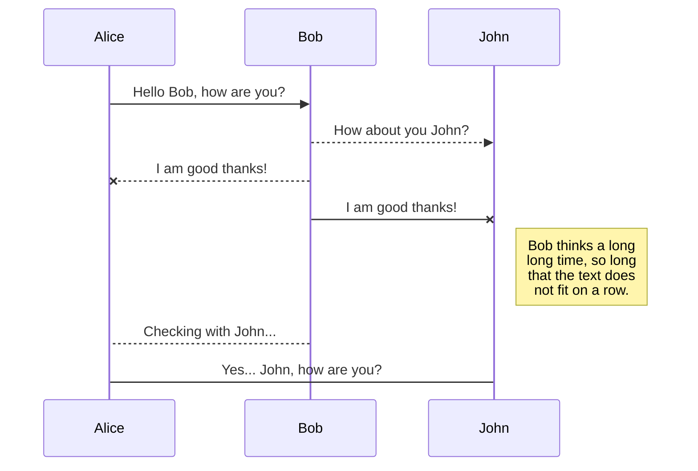
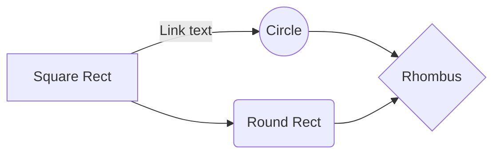

# Tic Tac Toe Game - Codeigniter 4 and React js

เป็นโปรแกรมเกม X/O ที่สร้างขึ้นโดยใช้ font-end เป็น React js และ back-end ใช้ Codeigniter 4 ติดต่อฐานข้อมูล mySql ด้วย Api ตัวโปรแกรม สามารถปรับขนาดของตารางได้ 3 ขนาดคือ 3x3,4x4 และ 5x5 เมื่อเกมมีผู้ชนะจะสามารถบันทึกประวัติการเล่น และดูประวัติการเล่นได้ 


## สารบัญ Table of Content

 - [ขั้นตอนการติดตั้ง](#%E0%B8%82%E0%B8%B1%E0%B9%89%E0%B8%99%E0%B8%95%E0%B8%AD%E0%B8%99%E0%B8%81%E0%B8%B2%E0%B8%A3%E0%B8%95%E0%B8%B4%E0%B8%94%E0%B8%95%E0%B8%B1%E0%B9%89%E0%B8%87)
 - [วิธีการใช้งาน](#%E0%B8%A7%E0%B8%B4%E0%B8%98%E0%B8%B5%E0%B8%81%E0%B8%B2%E0%B8%A3%E0%B9%83%E0%B8%8A%E0%B9%89%E0%B8%87%E0%B8%B2%E0%B8%99)
 - 

### ขั้นตอนการติดตั้ง   
### วิธีการใช้งาน 

### เครดิต


### Font-end Design
โดยการออกแบบหน้าเว็บจะพยายามทำออกมาให้เหมือนกับการเล่นเกมโดยใช้ โทนสี ฟ้อนต์ ให้ดูน่าสนใจ และ การใช้งานง่าย

### Back-end Design

  

### Game Logic

การเดินเกมจะมี function อยู่ 3 ส่วนหลัก คือ

  

1. function render() สำหรับการสร้างตาราง จะมีกำหนดตัวแปร history จากค่า history จากใน state ,กำหนดตัวแปร current ให้เข้าถึง array จำนวนครั้งที่เดินใน history โดยกำหนดค่ามาจาก state.stepNumber และ กำหนดตัวแปร winner จากการคำนวณโดยส่งค่า current.squares และ this.state.size ไปคำนวณผู้ชนะ

จากนั้นมีการส่งค่าไปใน Component Board เพื่อสร้างตาราง

```yaml
render() {
const history = this.state.history;
const current = history[this.state.stepNumber];
const winner = calculateWinner(current.squares, this.state.size);
let status;
if (winner) {
status = 'Winner: ' + winner;
console.log(this.btn_status.history,this.btn_status.disabled)
if(this.btn_status.history==true){
this.btn_status.disabled=true
}else{
this.btn_status.disabled=false
}
} else {
status = 'Next player: ' + (this.state.xIsNext ? 'X' : 'O');
}
.
.
.
<Board
squares={current.squares}
size={this.state.size}
onClick={(i) => this.handleClick(i)}
/>
```

  

2. function calculateWinner() สำหรับคำนวณผู้ชนะ โดยการตรวจสอบว่ามีแถว, คอลัมน์, หรือเส้นทแยงมุมใดที่มีเครื่องหมาย (X หรือ O) เหมือนกันทั้งหมดหรือไม่

```yaml

function calculateWinner(squares, size) {

const lines = [];

  

// ตรวจสอบแถวและคอลัมน์

for (let i = 0; i < size; i++) {

const row = [];

const col = [];

for (let j = 0; j < size; j++) {

row.push(i * size + j);

col.push(j * size + i);

}

lines.push(row);

lines.push(col);

}

  

// ตรวจสอบเส้นทแยงมุม

const diag1 = [];

const diag2 = [];

for (let i = 0; i < size; i++) {

diag1.push(i * size + i);

diag2.push(i * size + (size - i - 1));

}

lines.push(diag1);

lines.push(diag2);

  

// ตรวจสอบทุกเส้นที่บรรจุอยู่ใน lines

for (let i = 0; i < lines.length; i++) {

const [a, b, ...rest] = lines[i];

if (squares[a] && squares[a] === squares[b] && rest.every((index) => squares[a] === squares[index])) {

return squares[a];

}

}

return null;

}

```

  

3. function handleClick() สำหรับกำหนดค่า X | O ลงในปุ่มที่กดและเปลี่ยนตาผู้เล่น

```yaml

handleClick(i) {

const history = this.state.history.slice(0, this.state.stepNumber + 1);

const current = history[history.length - 1];

const squares = current.squares.slice();

if (calculateWinner(squares, this.state.size) || squares[i]) {

return;

}

squares[i] = this.state.xIsNext ? 'X' : 'O';

this.setState(

{

history: history.concat([

{

squares: squares,

},

]),

stepNumber: history.length,

xIsNext: !this.state.xIsNext,

},

() => this.saveGameHistory()

);

}

```
> **ProTip:** You can disable any **Markdown extension** in the **File properties** dialog.


## SmartyPants

SmartyPants converts ASCII punctuation characters into "smart" typographic punctuation HTML entities. For example:

|                |ASCII                          |HTML                         |
|----------------|-------------------------------|-----------------------------|
|Single backticks|`'Isn't this fun?'`            |'Isn't this fun?'            |
|Quotes          |`"Isn't this fun?"`            |"Isn't this fun?"            |
|Dashes          |`-- is en-dash, --- is em-dash`|-- is en-dash, --- is em-dash|


## KaTeX

You can render LaTeX mathematical expressions using [KaTeX](https://khan.github.io/KaTeX/):

The *Gamma function* satisfying $\Gamma(n) = (n-1)!\quad\forall n\in\mathbb N$ is via the Euler integral

$$
\Gamma(z) = \int_0^\infty t^{z-1}e^{-t}dt\,.
$$

> You can find more information about **LaTeX** mathematical expressions [here](http://meta.math.stackexchange.com/questions/5020/mathjax-basic-tutorial-and-quick-reference).


## UML diagrams

You can render UML diagrams using [Mermaid](https://mermaidjs.github.io/). For example, this will produce a sequence diagram:



And this will produce a flow chart:

